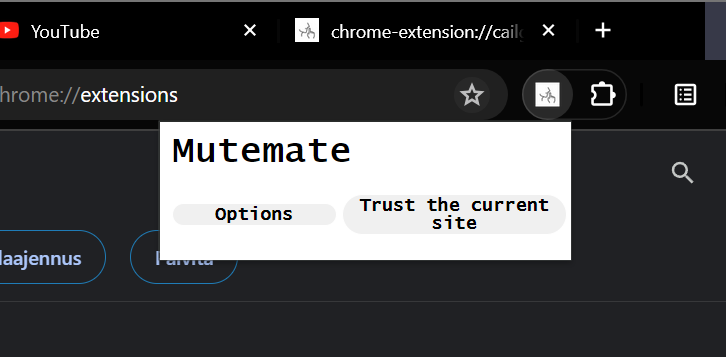

# Mutemate

A Chrome extension that automatically mutes sites that use autoplay videos with audio.
Maintains a list of trusted websites defined by the user. Trusted websites will be ignored by Mutemate and can operate as normal. Trusted websites can be added/removed using the chrome extension popup or the options page as shown below:

Extension is not published, because of the mandatory developer registration fee ($5), but by downloading this repository and uploading to chrome://extensions/, you can use it on your own chrome. 

Following photos will demostrate the usage:

What the options page looks like:

What the popup looks like on chrome:

What the popup looks like when you save current site as trusted:

